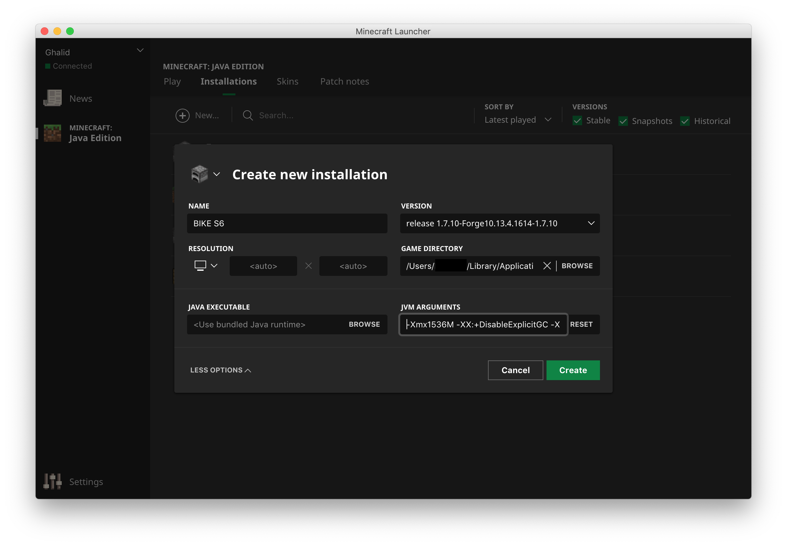
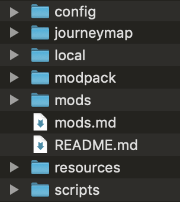
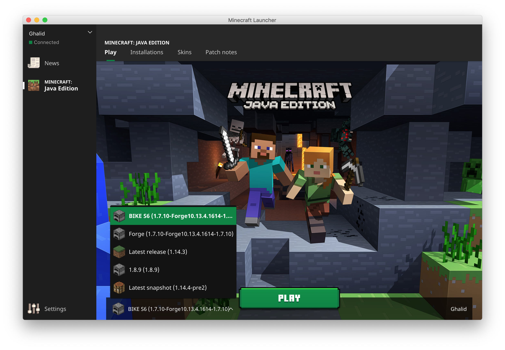

# Installation Guide (macOS)

_All instructions are intended for players who use the vanilla Minecraft launcher (downloaded from minecraft.net)._

1. Download the modpack ZIP. Just leave it where it is for now; you can continue with the steps while it downloads.
2. Run a *vanilla* instance of 1.7.10 with the launcher. Once open, you may close it.
3. Download the Minecraft Forge installer [here](https://files.minecraftforge.net/maven/net/minecraftforge/forge/1.7.10-10.13.4.1614-1.7.10/forge-1.7.10-10.13.4.1614-1.7.10-installer.jar) and run it. This will install Minecraft Forge.
   * Note: On a default configuration, when opening the Minecraft Forge installer jar file, you'll see a warning from Gatekeeper, shown below.
  
  To bypass this warning, right click (or hold CONTROL and click) on the jar file. Then, click Open on the list of options that appear, then click Open on the warning that appears.
   * If, for whatever reason, the linked installer before is not working, make sure you've ran vanilla 1.7.10 at least once before. If it is still not running, please contact a staff member with any error messages you see.
4. Open the Minecraft launcher. If it was already open, close it and reopen it.
5. On the top of the launcher, click the Installations tab. If you don't see the Installations tab, make sure that _Minecraft: Java Edition_ is selected on the sidebar to the left.
6. Click _New..._ to create a new installation.
7. In the prompt that appears, input the following information:
   * Name: Anything you'd like (such as BIKE S6)
   * Version: _release 1.7.10-Forge10.13.4.1614-1.7.10_
   * Game directory: _/Users/[your username]/Library/Application Support/minecraft/BIKES6_
     * Note: If you want to install the modpack elsewhere, this is where you change it. This directory (folder) is essentially where your `minecraft` folder is for the modpack installation, and is kept separate from your other installations. This directory means that your `minecraft` folder for the pack is inside the `BIKES6` folder inside of the normal `minecraft` folder. You can also achieve the same thing by clicking _Browse_, then creating a new folder inside the folder it shows you (which should be the normal `minecraft` folder).
8. In the bottom left of the prompt, click the _More Options_ dropdown.
9. For JVM Arguments, there should be some arguments already there. At the beginning, you should see `-Xmx[a number here]G`. This is how much RAM is allocated to the game. We recommend allocating anywhere from about 1.5 GB to 3 GB. Avoid going too much higher or lower, as this may cause problems. For example, if you want to allocate 1.5 GB of RAM to Minecraft, **replace** the default `-Xmx` value to:
    * `-Xmx1536M`
This will allocate 1536 MB to the game (which is equal to 1.5 GB).
    * Note **(not required, skip if it is too complex)**: You may experience better performance with a different set of arguments. For example, some arguments I like to use are:

        `-Xmx1536M -XX:+DisableExplicitGC -XX:+UseConcMarkSweepGC -XX:MaxGCPauseMillis=20`

        This will allocate 1.5 GB of RAM to the game, along with the other options. If you choose to use these, **remove all existing arguments** and paste in those arguments. YMMV, and this may improve or decrease performance depending on your system. If they do not work well for you, come back to this dialog and click the _Reset_ button in JVM Arguments.
10. Your install should look similar to the following:

Press the green _Create_ button to create the installation.
1.  Go to the folder you chose when creating your installation (in the Game Directory). If you went with our recommendation and chose a folder inside your regular `minecraft` folder, triple click this text:
    ```
    ~/Library/Application Support/minecraft/
    ```
    Right click it (or control + click) and click Services > Open. You can also manually navigate to it if you know how. If you followed our recommendation exactly, create a folder in here called `BIKES6` (or open it if it is already there).

12. Extract the modpack zip file you downloaded in step 1. (If you don't know what I mean, just double click it to open it)
13. A folder should've appeared with the modpack files. Go inside this folder that just appeared, then move all the files and folders here into the _Game Directory_ folder you opened earlier.
    * **IMPORTANT**: Make sure you are moving the folders/files named `mods`, `config`, `scripts`, etc. and NOT the folder that contains all of them. When you are done, your game directory (such as `BIKES6`) should contain these files: 

        
14. In the Minecraft launcher, click the _Play_ tab on the top. Near the bottom, select the installation you created, then hit _Play_.

