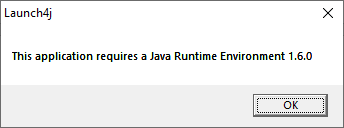
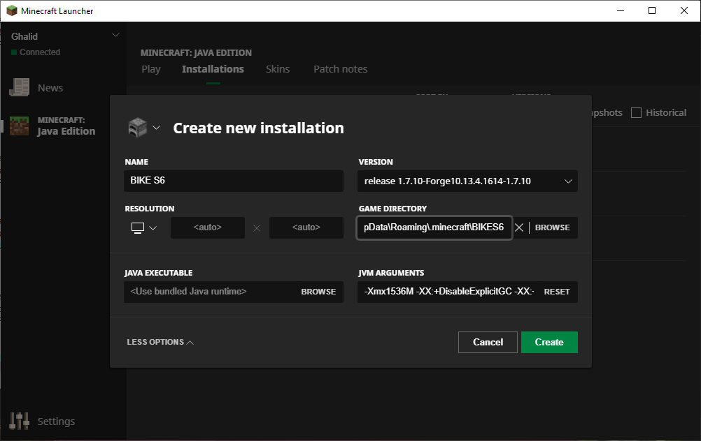
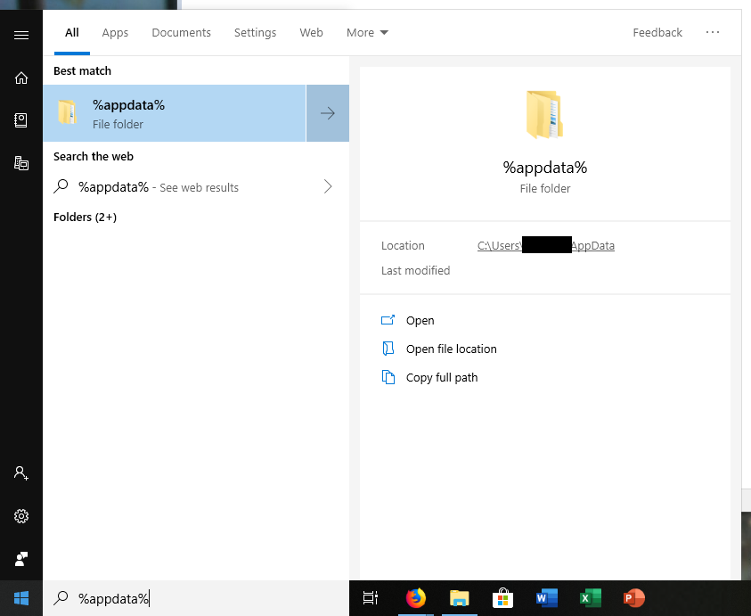
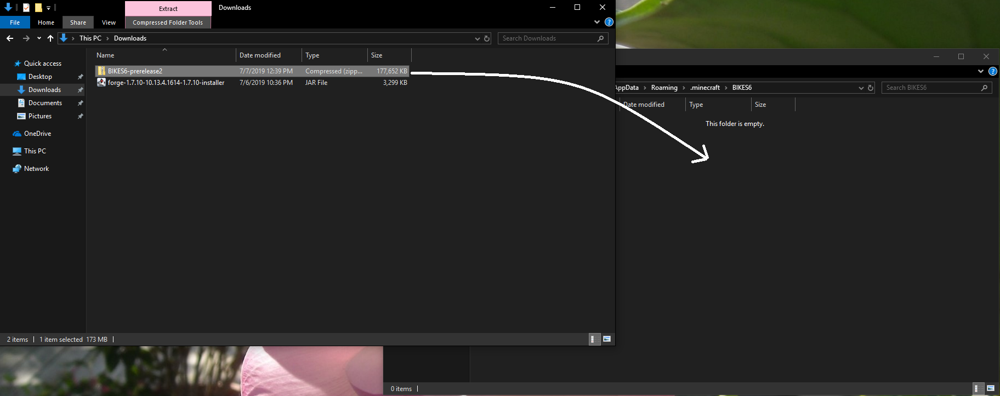
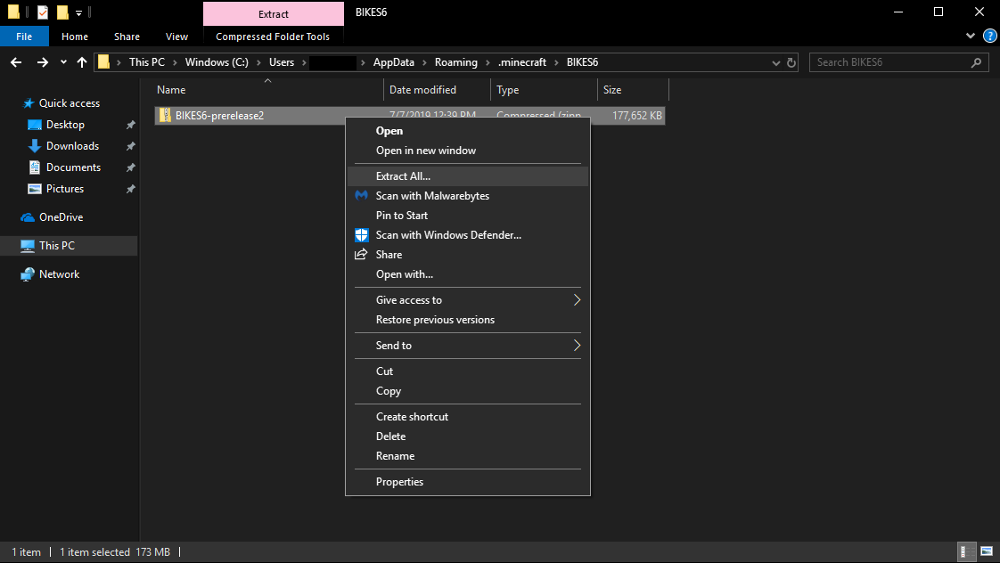
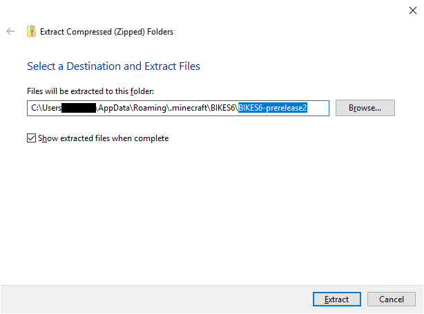
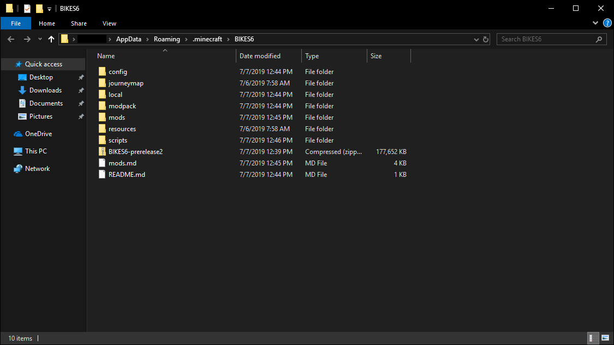
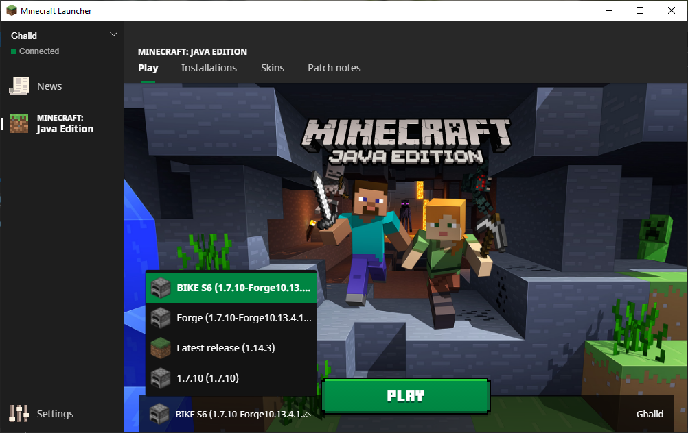

# Installation Guide (Windows)

_All instructions are intended for players who use the vanilla Minecraft launcher (downloaded from minecraft.net)._

1. Download the modpack ZIP. Just leave it where it is for now; you can continue with the steps while it downloads.
2. Run a *vanilla* instance of 1.7.10 with the launcher. Once open, you may close it.
3. Download the Minecraft Forge installer [here](https://files.minecraftforge.net/maven/net/minecraftforge/forge/1.7.10-10.13.4.1614-1.7.10/forge-1.7.10-10.13.4.1614-1.7.10-installer.jar) and run it. This will install Minecraft Forge.
   * If, for whatever reason, the linked installer before is not working, make sure you've ran vanilla 1.7.10 at least once before. If you have, try [this installer instead](https://files.minecraftforge.net/maven/net/minecraftforge/forge/1.7.10-10.13.4.1614-1.7.10/forge-1.7.10-10.13.4.1614-1.7.10-installer-win.exe). If neither work, please contact a staff member with any error messages you see.
   * If you see the below error with the installer:

        

        then you need to install Java. Go to [the official site](https://www.java.com) and follow the instructions to install it.
4. Open the Minecraft launcher. If it was already open, close it and reopen it.
5. On the top of the launcher, click the Installations tab. If you don't see the Installations tab, make sure that _Minecraft: Java Edition_ is selected on the sidebar to the left.
6. Click _New..._ to create a new installation.
7. In the prompt that appears, input the following information:
   * Name: Anything you'd like (such as BIKE S6)
   * Version: _release 1.7.10-Forge10.13.4.1614-1.7.10_
   * Game directory: _C:\Users\\[your username]\AppData\Roaming\\.minecraft\BIKES6_
     * Note: If you want to install the modpack elsewhere, this is where you change it. This directory (folder) is essentially where your `.minecraft` folder is for the modpack installation, and is kept separate from your other installations. This directory means that your `.minecraft` folder for the pack is inside the `BIKES6` folder inside of the normal `.minecraft` folder. You can also achieve the same thing by clicking _Browse_, then creating a new folder inside the folder it shows you (which should be the normal `.minecraft` folder).
8. In the bottom left of the prompt, click the _More Options_ dropdown.
9. For JVM Arguments, there should be some arguments already there. At the beginning, you should see `-Xmx[a number here]G`. This is how much RAM is allocated to the game. We recommend allocating anywhere from about 1.5 GB to 3 GB. Avoid going too much higher or lower, as this may cause problems. For example, if you want to allocate 1.5 GB of RAM to Minecraft, **replace** the default `-Xmx` value to:
    * `-Xmx1536M`
This will allocate 1536 MB to the game (which is equal to 1.5 GB).
    * Note **(not required, skip if it is too complex)**: You may experience better performance with a different set of arguments entirely. For more information, check the [performance guide](performance).
1.  Your installation should look something like below.
    
    Press the green _Create_ button to create the installation.
2.  Go to the folder you chose when creating your installation (in the Game Directory).
    1.  In the Windows search bar, type `%appdata%` and press ENTER.
        
    2. Open the `.minecraft` folder.
    3. Open the `BIKES6` folder, or create it if it does not exist. (If you chose a different directory in step 6, use that name instead.)
3.  Move the modpack zip file you downloaded in step 1 into this folder.

    
4.  Right click the zip file and click _Extract All..._.

    

5. **IMPORTANT**: When the prompt appears, remove all text after the last `\`. In the picture below, you would remove the highlighted part.

    
    * **IMPORTANT**: Make sure the game directory itself contains files and folders named `mods`, `config`, `scripts`, etc. and NOT a single folder that contains all of them. When you are done, your game directory (such as `BIKES6`) should contain these files: 
      * `mods`
      * `config`
      * `scripts`
      * `local`
      * `journeymap`
      * `modpack`
      * `resources`
      * If other text files exist (like `README.md`), these are okay to leave in. 

    
6.  In the Minecraft launcher, click the _Play_ tab on the top. Near the bottom, select the installation you created, then hit _Play_.

    
